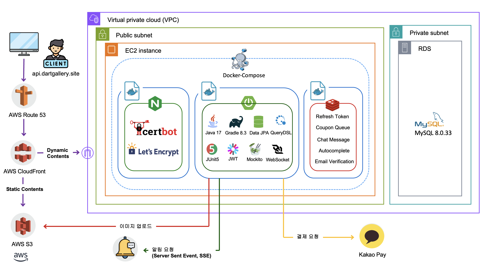
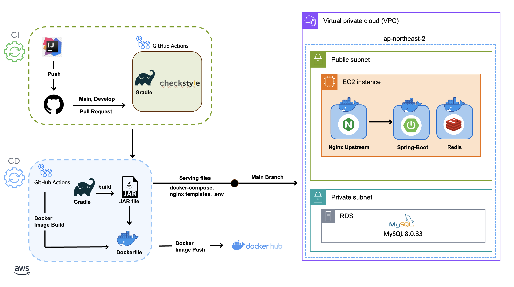
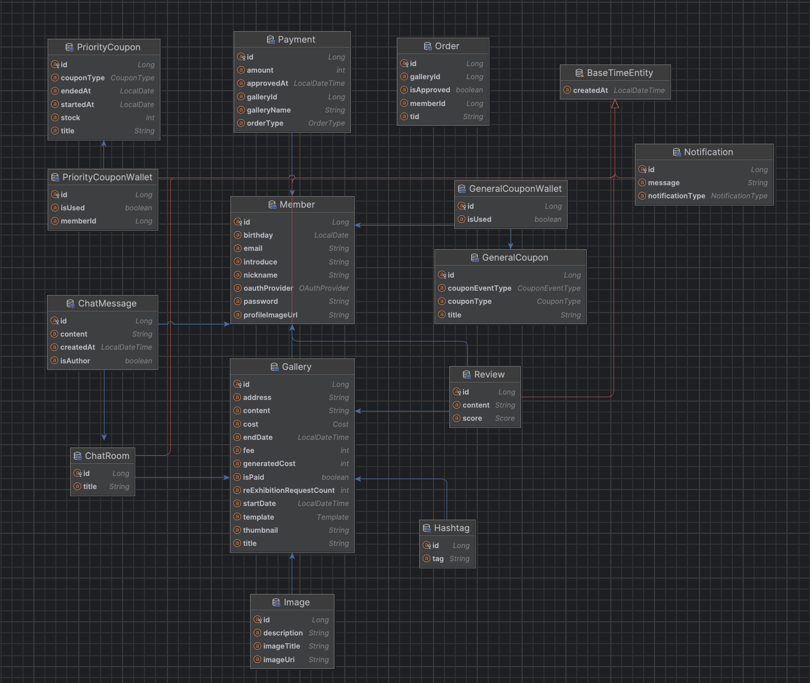
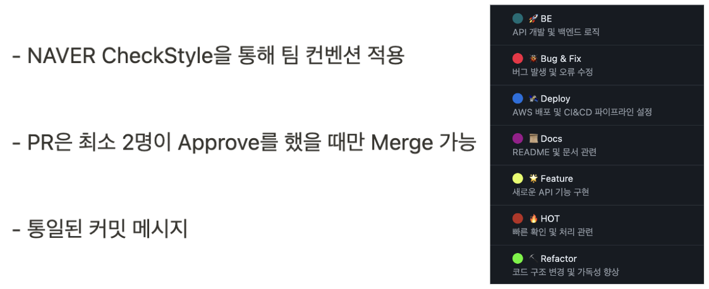
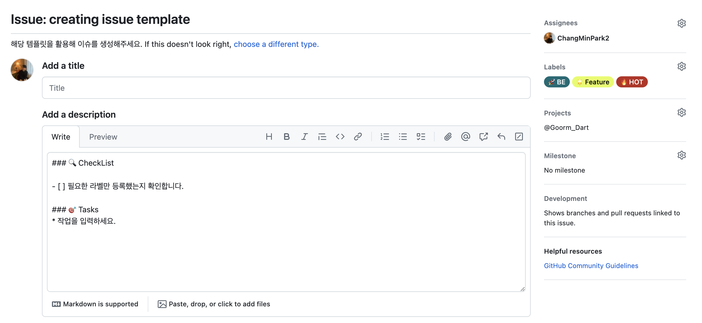
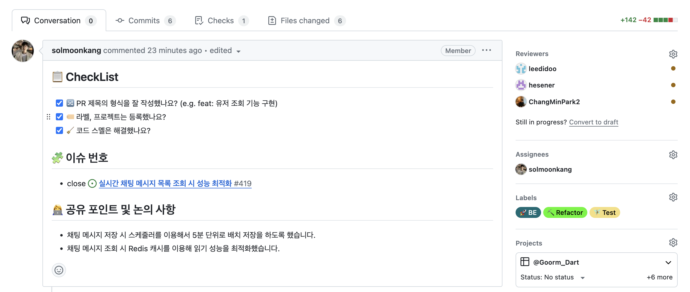

# 🎨 WEB 프로젝트 D'ART

## 🧑‍🧑‍🧒‍🧒 BACKEND TEAMMATE 소개
|         |  |  |  |
|-----------------------------------------------------|--------------------------------------------|----------------------------------------|----------------------------------------|
| [박창민](https://github.com/ChangMinPark2) **(BE 팀장)** | [강솔문](https://github.com/solmoonkang)      | [이지수](https://github.com/leedidoo)     | [심예은](https://github.com/hesener)      |
| **DEVELOPER**                                       | **DEVELOPER**                              | **DEVELOPER**                          | **DEVELOPER**                          |
| **결제, 쿠폰(선착순 이벤트), 캐싱, 리뷰**                         | **채팅, 알림, 인프라(AWS, CI&CD)**                | **전시 관리 및 이미지 최적화**        | **회원 및 소셜 로그인, 검색어 자동완성**              |

## 🚚 서비스 아키텍처

## 🛰️ CI&CD 파이프라인

## 👫🏻 ERD

### 기술 스택
| **Language & Library** |       |
|------------------------|------------------------|
| **DATABASE**           |    |
| **AWS**                |     |
| **CI/CD**              |    |
| **HTTP**               |  |
| **TEST**               |   |

## 💬 팀 컨벤션

### ISSUE 템플릿

### PR 템플릿

## 시연 영상
추후 업로드할 예정입니다.
